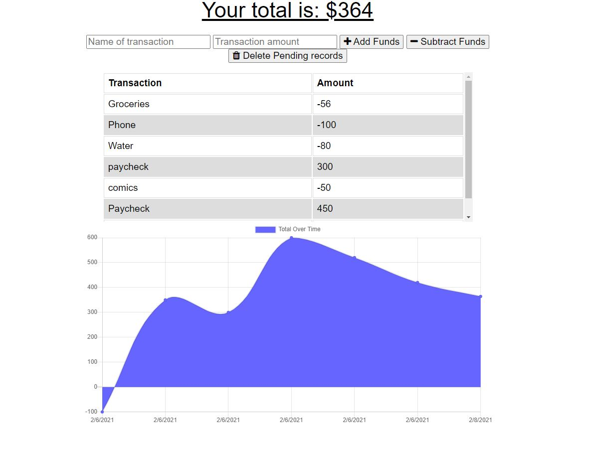

# Budget Tracker  
# Description  
This budget tracker allows users to enter transactions online or offline. After enterting an expense or deposit while offline, the app will update the total when brought back online.  
  
# Table of Contents  
- [Installation](#installation)
- [Usage](#usage)
- [Technology Used](#technology-used)
- [Contact](#contact)
# Installation  
```bash
npm i
```  
# Usage  
Easily track your budget by visiting the link provided below.  
# Technology Used  
- JS ES6
- Mongoose
- Heroku
- Express
- NPM
- HTML + CSS
# Contact  
[GitHub Link](https://github.com/bspencer181)
